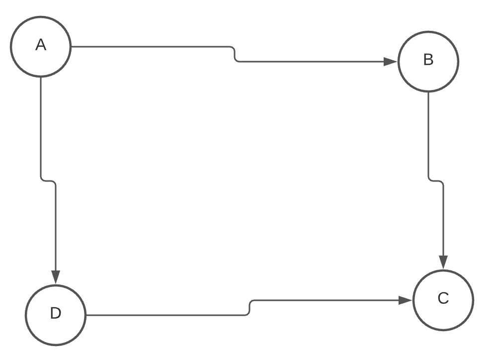
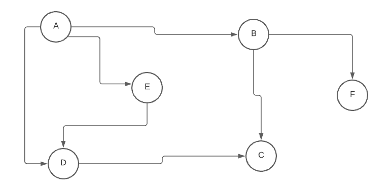

# Problem Statement and Constraints

## Doomsday Fuel
Making fuel for the LAMBCHOP's reactor core is a tricky process because of the exotic matter involved. It starts as raw ore, then during processing, begins randomly changing between forms, eventually reaching a stable form. There may be multiple stable forms that a sample could ultimately reach, not all of which are useful as fuel.

Commander Lambda has tasked you to help the scientists increase fuel creation efficiency by predicting the end state of a given ore sample. You have carefully studied the different structures that the ore can take and which transitions it undergoes. It appears that, while random, the probability of each structure transforming is fixed. That is, each time the ore is in 1 state, it has the same probabilities of entering the next state (which might be the same state). You have recorded the observed transitions in a matrix. The others in the lab have hypothesized more exotic forms that the ore can become, but you haven't seen all of them.

Write a function answer(m) that takes an array of array of nonnegative ints representing how many times that state has gone to the next state and return an array of ints for each terminal state giving the exact probabilities of each terminal state, represented as the numerator for each state, then the denominator for all of them at the end and in simplest form. The matrix is at most 10 by 10. It is guaranteed that no matter which state the ore is in, there is a path from that state to a terminal state. That is, the processing will always eventually end in a stable state. The ore starts in state 0. The denominator will fit within a signed 32-bit integer during the calculation, as long as the fraction is simplified regularly.

## Languages
To provide a Python solution, edit solution.py To provide a Java solution, edit solution.java

## Test Cases
For example, consider the matrix m:

```
[
  [0,1,0,0,0,1],  # s0, the initial state, goes to s1 and s5 with equal probability
  [4,0,0,3,2,0],  # s1 can become s0, s3, or s4, but with different probabilities
  [0,0,0,0,0,0],  # s2 is terminal, and unreachable (never observed in practice)
  [0,0,0,0,0,0],  # s3 is terminal
  [0,0,0,0,0,0],  # s4 is terminal
  [0,0,0,0,0,0],  # s5 is terminal
]
```

So, we can consider different paths to terminal states, such as:

```
s0 -> s1 -> s3
s0 -> s1 -> s0 -> s1 -> s0 -> s1 -> s4
s0 -> s1 -> s0 -> s5
```

Tracing the probabilities of each, we find that:
```
s2 has probability 0
s3 has probability 3/14
s4 has probability 1/7
s5 has probability 9/14
```

So, putting that together, and making a common denominator, gives an answer in the form of `[s2.numerator, s3.numerator, s4.numerator, s5.numerator, denominator]` which is: `[0, 3, 2, 9, 14]`.

Inputs: `(int) m = [[0, 2, 1, 0, 0], [0, 0, 0, 3, 4], [0, 0, 0, 0, 0], [0, 0, 0, 0, 0], [0, 0, 0, 0, 0]]`

Output: `(int list) [7, 6, 8, 21]`

Inputs: `(int) m = [[0, 1, 0, 0, 0, 1], [4, 0, 0, 3, 2, 0], [0, 0, 0, 0, 0, 0], [0, 0, 0, 0, 0, 0], [0, 0, 0, 0, 0, 0], [0, 0, 0, 0, 0, 0]]`

Output: `(int list) [0, 3, 2, 9, 14]`

# Solution

## The Maths
A wonderful explanation is already provided [here](https://github.com/ivanseed/google-foobar-help/blob/master/challenges/doomsday_fuel/doomsday_fuel.md). Here two concepts will be at play, one is the markov chain and other is the adjacency matrix property of a graph.

Assume we have a graph as follows




Now the adjecent matrix A of this graph will be

| | A | B | C | D |
| --- | --- | --- | --- | --- |
| A | 0 | 1 | 0 | 1 |
| B | 0 | 0 | 1 | 0 |
| C | 0 | 0 | 0 | 0 |
| D | 0 | 0 | 1 | 0 |

Now, A^2 is 

| | A | B | C | D |
| --- | --- | --- | --- | --- |
| A | 0 | 0 | 2 | 0 |
| B | 0 | 0 | 0 | 0 |
| C | 0 | 0 | 0 | 0 |
| D | 0 | 0 | 0 | 0 |

it can be seen we have element 2 at the A,C entry. That is there are 2 ways to reach A to C in 2 steps.

Now we repeat the same experiment but we replace the values with the probability score, in the adjacency matrix, this is called the transition matrix in [Markov Chain](https://en.wikipedia.org/wiki/Markov_chain).

| | A | B | C | D |
| --- | --- | --- | --- | --- |
| A | 0 | 0.5 | 0 | 0.5 |
| B | 0 | 0 | 1.0 | 0 |
| C | 0 | 0 | 0 | 1.0 |
| D | 0 | 0 | 1.0 | 0 |


Now A^2 is 

| | A | B | C | D |
| --- | --- | --- | --- | --- |
| A | 0 | 0 | 1 | 0 |
| B | 0 | 0 | 1 | 0 |
| C | 0 | 0 | 1 | 0 |
| D | 0 | 0 | 1 | 0 |

which means from A we wound up at C with probability 1, so are other nodes. 
In this simplified example we start at A with equal probability going to state B and D and then with probability 1 we to go to C. Now C is called sink in the Directed Graph or in Markov Chain terms an absorbing state, that is from that state we cannot go to any other state.

Lets consider another example to be perfectly clear.

Consider another graph



The transition matrix is
| | A | B | C | D | E | F |
| --- | --- | --- | --- | --- | --- | --- |
| A | 0.0 | 0.5 | 0.0 | 0.3 | 0.2 | 0.0 |
| B | 0.0 | 0.0 | 0.5 | 0.0 | 0.0 | 0.5 |
| C | 0.0 | 0.0 | 1.0 | 0.0 | 0.0 | 0.0 |
| D | 0.0 | 0.0 | 1.0 | 0.0 | 0.0 | 0.0 |
| E | 0.0 | 0.0 | 0.0 | 1.0 | 0.0 | 0.0 |
| F | 0.0 | 0.0 | 0.0 | 0.0 | 0.0 | 1.0 |


Now A^2 is 

| | A | B | C | D | E | F |
| --- | --- | --- | --- | --- | --- | --- |
| A | 0.00 | 0.00 | 0.55 | 0.20 | 0.00 | 0.25 |
| B | 0.00 | 0.00 | 0.50 | 0.00 | 0.00 | 0.50 |
| C | 0.00 | 0.00 | 1.00 | 0.00 | 0.00 | 0.00 |
| D | 0.00 | 0.00 | 1.00 | 0.00 | 0.00 | 0.00 |
| E | 0.00 | 0.00 | 1.00 | 0.00 | 0.00 | 0.00 |
| F | 0.00 | 0.00 | 0.00 | 0.00 | 0.00 | 1.00 |

We see the probability that starting from A we wound up at C after 2 steps is 0.55, to D is 0.2 and F is 0.25. It can be easily computed listing the paths as well. For `Pr(A,C,2)` we have `Pr(A,B,1) * Pr(B,C,1) + Pr(A,D,1) * Pr(D,C,1)`, where Pr(X,Y,n) means probability from going X to Y in n steps.

`Pr(A,C,2) = 0.5*0.5 + 0.3*1 = 0.55`


Now, writing the given test example in transition matrix we have the follows

| | s2 | s3 | s4 | s5 | s0 | s1
| --- | --- | --- | --- | --- | --- | --- |
| s2 | 1 | 0 | 0 | 0 | 0 | 0 |
| s3 | 0 | 1 | 0 | 0 | 0 | 0 |
| s4 | 0 | 0 | 1 | 0 | 0 | 0 |
| s5 | 0 | 0 | 0 | 1 | 0 | 0 |
| s0 | 0 | 0 | 0 | 1/2 | 0 | 1/2 |
| s1 | 0 | 3/9 | 2/9 | 0 | 4/9 | 0 |

s2, s3, s4 and s5 are all absorbing states meaning that the probability of getting to another state apart from itself is zero. While s0 and s1 are non absorbing states.

We are interested in the transition matrix spanned by the non-absorbing matrix, which means the subgraph only containing the non-absorbing nodes. Lets name that sub-matrix as `Q` all we do is find sum of all powers of `Q`. 

In our case `Q` is 
| | s0 | s1 |
| --- | --- | --- |
| s0 | 0 | 1/2 |
| s1 | 4/9 | 0 |

And we compute all power of `Q` and sum up, we do this as we have infinite time to reach the non-absorbing state so we need to consider all possible paths that lead to it including all the cycles.

So we compute `Q^0` + `Q` + `Q^2` + `Q^3` + `Q^4` + `Q^5` + `Q^6` ..... = `S`,
which is equal to `(I - Q)^-1`, we are guaranteed that `S` is converging as per the constraints.

Notice : `Q^0` means we don't even take one step with in the non-absorbing portion of the graph directly move from non-absorbing states to absorbing states.

`S = I + Q^1 + Q^2 + Q^3....`

`S*Q = Q + Q^2 + Q^3 + Q^4....`

`S(I-Q) = I`

`S = (I-Q)^-1`

And for the step where we go from non-absorbing state to absorbing state, we need the sub-matrix with non-aboribing and absorbing states, lets name it `R`. `R` in our case is

| | s2 | s3 | s4 | s5 |
| --- | --- | --- | --- | --- |
| s0 | 0 | 0 | 0 | 1/2 |
| s1 | 0 | 3/9 | 2/9 | 0 |

so the final transition matrix is `S * R`, from which we only report s0's probability.

## Code
There are two main points to notice about the code, which are
- To maintain fractional portion I wrote a class which handled fraction addition, multiplication, division and subtraction by overloading the operators using `__add__, __sub__, __mul__` and `__truediv__`.

- I didn't use numpy or any other library for matrix multiplication and inverse.
