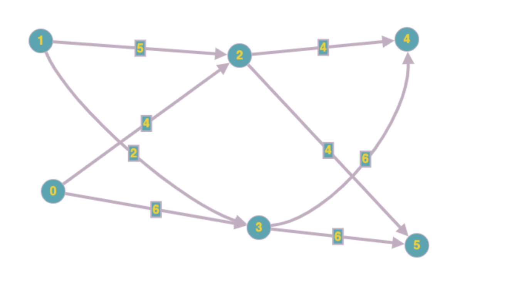
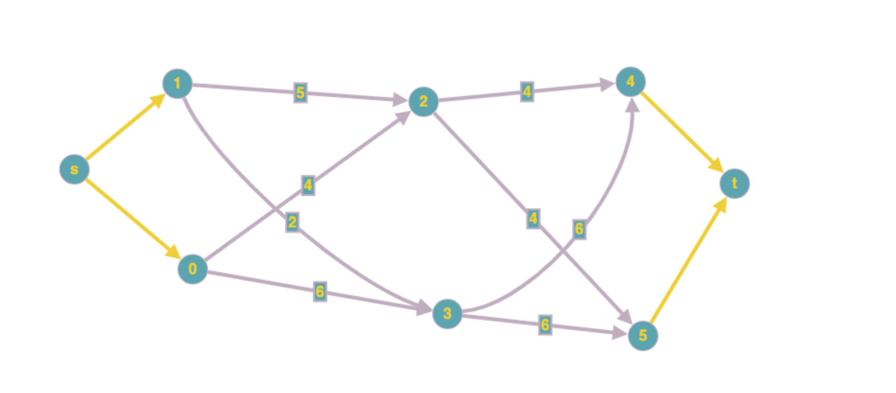

# Escape Pods


You've blown up the LAMBCHOP doomsday device and relieved the bunnies of their work duries -- and now you need to escape from the space station as quickly and as orderly as possible! The bunnies have all gathered in various locations throughout the station, and need to make their way towards the seemingly endless amount of escape pods positioned in other parts of the station. You need to get the numerous bunnies through the various rooms to the escape pods. Unfortunately, the corridors between the rooms can only fit so many bunnies at a time. What's more, many of the corridors were resized to accommodate the LAMBCHOP, so they vary in how many bunnies can move through them at a time. 

Given the starting room numbers of the groups of bunnies, the room numbers of the escape pods, and how many bunnies can fit through at a time in each direction of every corridor in between, figure out how many bunnies can safely make it to the escape pods at a time at peak.

Write a function solution(entrances, exits, path) that takes an array of integers denoting where the groups of gathered bunnies are, an array of integers denoting where the escape pods are located, and an array of an array of integers of the corridors, returning the total number of bunnies that can get through at each time step as an int. The entrances and exits are disjoint and thus will never overlap. The path element `path[A][B] = C` describes that the corridor going from A to B can fit C bunnies at each time step.  There are at most 50 rooms connected by the corridors and at most 2000000 bunnies that will fit at a time.

For example, if you have:
```
entrances = [0, 1]
exits = [4, 5]
path = [
  [0, 0, 4, 6, 0, 0],  # Room 0: Bunnies
  [0, 0, 5, 2, 0, 0],  # Room 1: Bunnies
  [0, 0, 0, 0, 4, 4],  # Room 2: Intermediate room
  [0, 0, 0, 0, 6, 6],  # Room 3: Intermediate room
  [0, 0, 0, 0, 0, 0],  # Room 4: Escape pods
  [0, 0, 0, 0, 0, 0],  # Room 5: Escape pods
]
```
Then in each time step, the following might happen:
0 sends 4/4 bunnies to 2 and 6/6 bunnies to 3
1 sends 4/5 bunnies to 2 and 2/2 bunnies to 3
2 sends 4/4 bunnies to 4 and 4/4 bunnies to 5
3 sends 4/6 bunnies to 4 and 4/6 bunnies to 5

So, in total, 16 bunnies could make it to the escape pods at 4 and 5 at each time step.  (Note that in this example, room 3 could have sent any variation of 8 bunnies to 4 and 5, such as 2/6 and 6/6, but the final solution remains the same.)

# Languages


To provide a Java solution, edit Solution.java
To provide a Python solution, edit solution.py

# Test cases

Your code should pass the following test cases.
Note that it may also be run against hidden test cases not shown here.
```
-- Java cases --
Input:
Solution.solution({0, 1}, {4, 5}, {{0, 0, 4, 6, 0, 0}, {0, 0, 5, 2, 0, 0}, {0, 0, 0, 0, 4, 4}, {0, 0, 0, 0, 6, 6}, {0, 0, 0, 0, 0, 0}, {0, 0, 0, 0, 0, 0}})
Output:
    16

Input:
Solution.solution({0}, {3}, {{0, 7, 0, 0}, {0, 0, 6, 0}, {0, 0, 0, 8}, {9, 0, 0, 0}})
Output:
    6

-- Python cases --
Input:
solution.solution([0], [3], [[0, 7, 0, 0], [0, 0, 6, 0], [0, 0, 0, 8], [9, 0, 0, 0]])
Output:
    6

Input:
solution.solution([0, 1], [4, 5], [[0, 0, 4, 6, 0, 0], [0, 0, 5, 2, 0, 0], [0, 0, 0, 0, 4, 4], [0, 0, 0, 0, 6, 6], [0, 0, 0, 0, 0, 0], [0, 0, 0, 0, 0, 0]])
Output:
    16
```


# Solution

We model this as the graph flow problem, we make few assumptions for this problem we assume that there is a room called the source room which is connected to the starting room via corridors which are of infinite capacity.

Similarly, we have a room called the sink room which are connected to the escape rooms with infinite corridor capacity.

In the given example we have graph as




Now after addition of sink and source we have the graph as



where yellow edge denotes infinite capacity.

We used the Edmonds-Karp Algorithm

```
input:
        graph   (graph[v] should be the list of edges coming out of vertex v in the
                 original graph and their corresponding constructed reverse edges
                 which are used for push-back flow.
                 Each edge should have a capacity, flow, source and sink as parameters.)
        s       (Source vertex)
        t       (Sink vertex)
    output:
        flow    (Value of maximum flow)
    
    flow := 0   (Initialize flow to zero)
    repeat
        (Run a breadth-first search (bfs) to find the shortest s-t path.
         We use 'pred' to store the edge taken to get to each vertex,
         so we can recover the path afterwards)
        q := queue()
        q.push(s)
        pred := array(graph.length)
        while not empty(q)
            cur := q.pull()
            for Edge e in graph[cur] do
                if pred[e.t] = null and e.t != s and e.cap > e.flow then
                    pred[e.t] := e
                    q.push(e.t)

        if not (pred[t] = null) then
            (We found an augmenting path.
             See how much flow we can send) 
            df := inf
            for (e := pred[t]; e != null; e := pred[e.s]) do
                df := min(df, e.cap - e.flow)
            (And update edges by that amount)
            for (e := pred[t]; e != null; e := pred[e.s]) do
                e.flow  := e.flow + df
            flow := flow + df

    until pred[t] = null  (i.e., until no augmenting path was found)
    return flow
```
The running time of O(|V||E|^{2}) is found by showing that each augmenting path can be found in O(|E|) time, 
that every time at least one of the E edges becomes saturated (an edge which has the maximum possible flow), 
that the distance from the saturated edge to the source along the augmenting path must be longer than last time it was saturated,
and that the length is at most |V|. 
Another property of this algorithm is that the length of the shortest augmenting path increases monotonically.

# References

1. [Max Flow Problem](https://en.wikipedia.org/wiki/Maximum_flow_problem)
2. [EdmondsKarp Algorithm](https://en.wikipedia.org/wiki/Edmonds%E2%80%93Karp_algorithm)